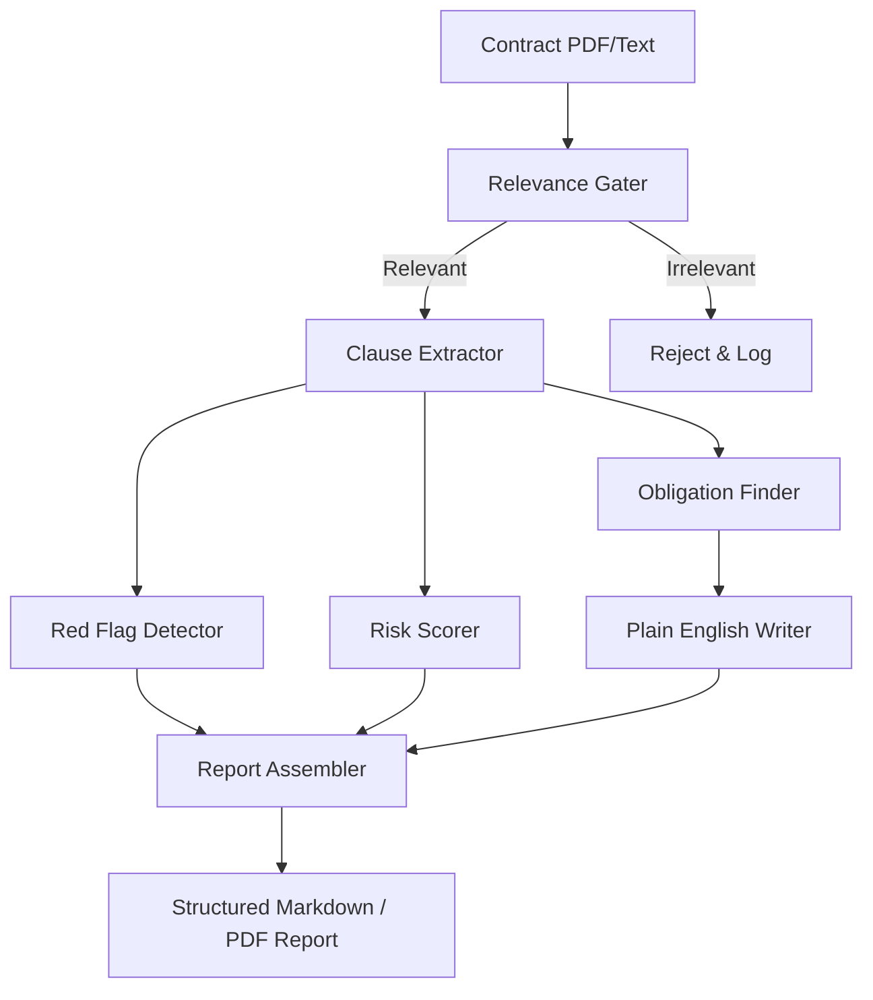

# AI Contract Reviewer

A production-grade, multi-agent contract analysis and QA platform. The application parses contracts, extracts clauses, highlights obligations, flags hidden risks, scores liabilities, writes non-legal summaries, and answers user questions via a context-aware RAG pipeline.

It integrates state-of-the-art Azure AI services, includes a local heuristics fallback for offline environments, and coordinates its agents using a structured cooperative message-passing design powered by **LangGraph**.

---

## 🛠️ Tech Stack & Design Choices

* **LangGraph**
  * *Why used*: Needed a structured framework to model complex cyclic and parallel multi-agent workflows. Standard chain-of-thought libraries fail at loops, human-in-the-loop gating, and state persistence; LangGraph handles complex agent routing, error fallbacks, and state checkpointing natively.
* **FastAPI**
  * *Why used*: Serves as the asynchronous gateway. FastAPI provides high-performance ASGI execution, enabling real-time token streaming during analysis, async processing queues, and lightweight endpoint wrappers for PDF/DOCX exporting.
* **Streamlit**
  * *Why used*: Chosen for rapid UI prototyping. It lets legal and business users upload documents, review risk scores side-by-side, and chat with the contract QA module directly without introducing front-end building overhead.
* **Azure OpenAI**
  * *Why used*: Selected for enterprise compliance, data privacy, and reliable throughput. Legal contract reviews process sensitive commercial terms, and Azure guarantees that data is not logged or used to train public LLM weights.
* **Azure Document Intelligence**
  * *Why used*: Traditional PDF parsers (like simple OCR tools) strip table headers, columns, and document hierarchies. DI extracts structured layout schemas, preserving critical tabular data and nested list levels for accurate RAG chunking.
* **Azure AI Search**
  * *Why used*: Serves as the primary enterprise hybrid search catalog. Enables cross-referencing extracted contract clauses with internal regulatory baselines and standard legal playbooks.
* **Qdrant**
  * *Why used*: Serves as our local semantic memory and **Semantic Cache**. Qdrant provides extremely fast vector indexing with advanced payload filtering, acting as our fallback storage for local deployment, semantic conversation history retrieval, and caching of LLM extraction chunks to save token costs.
* **Redis**
  * *Why used*: Low-latency checkpoint storage. Redis acts as the backing store for LangGraph's binary checkpoints, allowing reviews to pause, resume, and retrieve historical conversation states instantly.
* **LangFuse & Extraction Tracing**
  * *Why used*: Selected for audit telemetry and prompt engineering logs. Tracing multi-agent chains requires tracking precise input prompt templates, raw model completions, agent durations, and calculating combined API costs. We also employ a local extraction tracer for Phase-2 recall debugging, writing step-by-step artifact dumps.
* **PyMuPDF**
  * *Why used*: Fast local PDF text extraction fallback. Minimizes latency and API costs when parsing native, non-scanned digital PDFs, bypassing cloud endpoints when OCR is not required.
* **DeepEval**
  * *Why used*: Automated evaluation regression suite. Ensures that updates to agents or system prompt templates do not introduce hallucinations, summary omissions, or poor QA relevancy scores.

---

## 🧠 Multi-Agent Architecture & Model Routing

The contract review pipeline employs a cooperative multi-agent system. Different agents are routed to different LLMs based on task complexity, speed requirements, and cost-efficiency. It also supports an offline **Batch Processing pipeline** via OpenAI's Batch API for bulk contract analysis.



### 1. Relevance Gater
* **Model**: `gemini-2.5-flash` / `gemini-3.1-flash-lite` (or custom Groq fallback)
* **Rationale**: Acting as the system's gatekeeper, it runs instant classification to block unrelated queries, gibberish, or prompt injection attempts. Gemini's flash models are chosen for their **extremely low latency, massive context capability, and minimal cost**, protecting downstream agents from consuming expensive tokens on invalid queries.

### 2. Clause Extractor
* **Model**: `GPT-4o`
* **Rationale**: Extracting legal clauses and organizing them into a structured schema requires a model that excels at **fine-grained structural analysis and compliance**. `GPT-4o` was chosen to ensure that complex legal jargon, nested subclauses, and formatting markers are accurately parsed without missing hidden boundaries.

### 3. Obligation Finder
* **Model**: `GPT-4o-mini`
* **Rationale**: Identifying active party agreements ("who does what, and by when") is a structured information extraction task. `GPT-4o-mini` is highly cost-effective and provides **fast JSON schema parsing** for straightforward task-oriented extractions from the already isolated clauses.

### 4. Red Flag Detector
* **Model**: `GPT-4o-mini` *(Optimized back from GPT-4o in Sprint 2)*
* **Rationale**: Initially tested with `GPT-4o-mini` and upgraded to `GPT-4o` for deep logical negative-space inference. It was subsequently optimized back to `GPT-4o-mini` in Sprint 2 for cost-efficiency, utilizing structured JSON payload compression to maintain robust legal check recall at fraction of the cost.

### 5. Risk Scorer
* **Model**: `GPT-4o-mini` *(Optimized from GPT-4o in Sprint 2)*
* **Rationale**: Compares extracted clauses against guidelines retrieved via RAG. Optimized to `GPT-4o-mini` in Sprint 2, it leverages compressed payload representations and RAG standards to produce consistent scoring rationals at minimal token cost.

### 6. Plain English Writer
* **Model**: `GPT-4o-mini`
* **Rationale**: Translating legal terminology into natural, accessible summaries is a language generation task where lightweight models shine. `GPT-4o-mini` provides **high-speed translation** without consuming large token budgets.

### 7. Report Assembler
* **Model**: `GPT-4o-mini` *(Optimized from GPT-4o in Sprint 2)*
* **Rationale**: Synthesizes preceding agent outputs, resolves conflicting scores, and logs warnings. Using `GPT-4o-mini` keeps the final verification pass cost-effective while maintaining unified report formatting.

### 8. Chatbot Agent
* **Model**: `GPT-4o` (Vision) / `GPT-4o-mini` (Text)
* **Rationale**: Acting as the interactive Q&A layer, the Chatbot is a dynamic tool-using agent. It natively binds functions (`chat_tools.py`) to fetch contract metadata, visual page screenshots, and active obligations, routing questions between text and vision models based on the availability of image crops.

---

## ⚡ Setup & Run Instructions

Ensure your local virtual environment is prepared using `uv` (or standard `pip` as a fallback).

### 1. Environment Configuration
Copy the template configuration file:
```bash
cp .env.example .env
```
Open `.env` and fill in your Azure endpoints, search credentials, and optional DeepEval keys.

### 2. Local Host Setup
Run the application natively on your computer:

```bash
# 1. Sync dependencies (using uv)
uv sync

# 2. Start the FastAPI backend
.venv\Scripts\uvicorn.exe main:app --host 0.0.0.0 --port 8000

# 3. Start the Streamlit frontend (in a separate terminal)
.venv\Scripts\streamlit.exe run streamlit_app.py --server.port 8501
```

*Note: Natively running requires local Redis and Qdrant instances running on their default ports (`6379` and `6333`).*

### 3. Containerized Setup (Docker - Recommended)
If you have Docker installed, you can spin up the entire application stack (Backend, Frontend, Redis, and Qdrant) isolated in a bridge network. A helper [Makefile](Makefile) is provided to make operations simpler:

```bash
# Build the multi-stage, non-root runner image
make build

# Start backend, frontend, redis, and qdrant containers in background
make up

# Watch container logs in real time
make logs

# Shut down all services
make down
```

---

## 🧪 Testing & LLM Evaluations

The test suite covers unit testing of agent states, path traversals, confidence score coercions, and security gating.

### Running Unit Tests
To execute standard unit tests:
```bash
.venv\Scripts\python.exe -m pytest tests/
```

### Running DeepEval LLM-in-Loop Evaluations
Automated evaluations score your LLM outputs using DeepEval:
1. Ensure your `OPENAI_API_KEY` (or active Azure credentials in `.env`) is configured.
2. Run the evaluation suite:
   ```bash
   .venv\Scripts\python.exe -m pytest tests/test_deepeval_contract.py -v -s
   ```
   *(If run in an offline environment without API keys, the test suite will gracefully skip the evaluations to prevent test pipeline crashes).*

---

## 📂 Project Structure

```
AI_Contract_Reviewer/
├── src/
│   ├── agents/            # Core agent logic (Clause Extractor, Risk Scorer, etc.)
│   ├── controllers/       # FastAPI route controllers and orchestration
│   ├── helpers/           # Text cleaners, exporters, and validators
│   ├── models/            # Pydantic schemas and risk validators
│   ├── prompts/           # LLM system prompts and guidelines
│   ├── services/          # Azure client factories, Chat service, and tracers
│   ├── workflows/         # LangGraph state machine workflow definitions
│   └── fastapi_app.py     # FastAPI application instance
├── tests/                 # Standard unit tests and DeepEval metrics
├── main.py                # App entrypoint
├── Makefile               # Compose helper script
├── docker-compose.yml     # Compose file orchestrating app services
├── Dockerfile             # Multi-stage optimized Dockerfile
└── README.md              # This guide
```

## 📊 Agents vs Tools Classification

**Agents** (LLM‑driven orchestration nodes):
- ClauseExtractorAgent
- ObligationFinderAgent
- RedFlagDetectorAgent
- RiskScorerAgent
- PlainEnglishWriterAgent
- ReportAssemblerAgent
- ChatbotAgent (dynamic tool-using conversational node)
- RelevanceGater (gatekeeper)

**Tools** (external services & libraries used by agents):
- Azure Document Intelligence (OCR / Layout)
- Azure OpenAI (LLM completions & embeddings)
- Azure Key Vault (secrets management)
- Azure Search (enterprise vector‑search)
- Qdrant (vector store for clause vectors)
- Redis (state checkpointing & caching)
- Langfuse (observability)
- Streamlit (frontend UI)
- FastAPI (API orchestration)
- PyMuPDF (fallback PDF parsing)
- Docker / Kubernetes (deployment)

